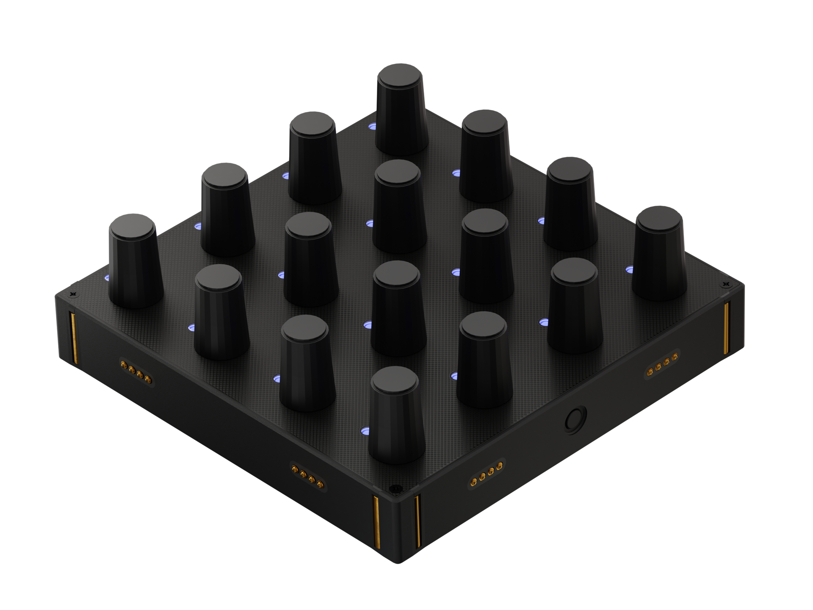

# Intech EN16 Ableton Control Surface



Control Ableton Live with the Intech EN16 grid controller.

## Features

| Control | Function |
|---------|----------|
| Buttons 1-8 | Select track (long press to arm) |
| Buttons 9-12 | Select return track |
| Buttons 13-16 | Launch/stop clips 1-4 on selected track |
| Encoders 1-8 | Device parameters |
| Encoders 9-12 | (available for custom mapping) |
| Encoder 13 | Send C (selected track) |
| Encoder 14 | Send B (selected track) |
| Encoder 15 | Send A (selected track) |
| Encoder 16 | Volume (selected track) |
| Control Button | Refresh surface |

## Installation

1. Copy this folder to Ableton's Remote Scripts location:
   ```
   ~/Music/Ableton/User Library/Remote Scripts/Intech
   ```

2. In Ableton Live, go to **Preferences → Link, Tempo & MIDI**

3. Set Control Surface to **Intech**, Input/Output to your EN16 MIDI ports

4. Restart Ableton Live

## Project Structure

```
Intech/
├── __init__.py              # Entry point
├── control_surface/         # Python project
│   ├── Grid.py              # Control surface implementation
│   ├── pyproject.toml
│   └── pyrightconfig.json
├── configs/
│   └── EN16-Control.json    # Grid controller configuration
├── grid-cli/
│   ├── grid-cli.ts          # Upload/download Grid configs
│   └── README.md            # CLI documentation
├── docs/
│   ├── EN16_CONFIG.md       # EN16 configuration guide
│   ├── GRID_LUA.md          # Grid Lua API reference
│   └── GRID_FIRMWARE.md     # Firmware internals
└── __ext__/
    └── AbletonLive12_MIDIRemoteScripts/  # Type hints (git submodule)
```

## Development

### Prerequisites

- Ableton Live 11+ (uses `_Framework`)
- Python 3.x (bundled with Live)

### Enable Script Reloading

Add to `Options.txt` (requires Ableton Beta):
```
-_ToolsMenuRemoteScripts
```

Location:
- macOS: `/Users/[username]/Library/Preferences/Ableton/Live x.x.x/Options.txt`
- Windows: `%APPDATA%\Ableton\Live x.x.x\Preferences\Options.txt`

### View Logs

```bash
# macOS
tail -f ~/Library/Preferences/Ableton/Live\ */Log.txt | grep -i intech

# Windows
Get-Content "$env:APPDATA\Ableton\Live *\Preferences\Log.txt" -Wait | Select-String "intech"
```

### Clear Cache Before Reload

After editing Python files, clear the bytecode cache:
```bash
rm -rf __pycache__
```

Then reload via Preferences (toggle Control Surface) or Tools → Reload MIDI Remote Scripts.

### Type Checking

This project includes `AbletonLive12_MIDIRemoteScripts` as a git submodule for type hints:

```bash
git submodule update --init
```

### References

- [AbletonLive12_MIDIRemoteScripts](https://github.com/gluon/AbletonLive12_MIDIRemoteScripts) - Decompiled scripts
- [ableton-control-surface-toolkit](https://github.com/oslo1989/ableton-control-surface-toolkit) - Live object documentation

---

# Grid CLI Tool

A command-line tool for uploading/downloading Grid controller configurations without Grid Editor.

## Quick Start

```bash
cd grid-cli
npm install

# Upload config to device
npx tsx grid-cli.ts upload ../configs/EN16-Control.json

# Download config from device
npx tsx grid-cli.ts download ./backup.json -t EN16
```

See [grid-cli/README.md](grid-cli/README.md) for full documentation.

---

# EN16 Configuration

The controller requires a custom Lua profile to send MIDI messages and receive feedback from Ableton.

## MIDI Layout

| Control | Type | Channel | Identifiers |
|---------|------|---------|-------------|
| Encoders | CC | 0 | 32-47 |
| Buttons | Note | 0 | 32-47 |
| Long Buttons | Note | 0 | 48-63 |
| Control Button | Note | 0 | 64 |

## Setup

Configure the EN16 using [Grid Editor](https://docs.intech.studio/guides/introduction) or upload via CLI:

```bash
cd grid-cli && npm install
npx tsx grid-cli.ts upload ../configs/EN16-Control.json
```

See [EN16 Configuration Guide](docs/EN16_CONFIG.md) for detailed Lua scripts and explanation.

## References

- [EN16 Configuration Guide](docs/EN16_CONFIG.md) - Element scripts and MIDI routing
- [Grid CLI Tool](grid-cli/README.md) - Upload/download configurations
- [Grid Lua API](docs/GRID_LUA.md) - Full API reference
- [Grid Firmware Internals](docs/GRID_FIRMWARE.md) - Device runtime details

---

## Known Issues

**Initial sync delay**: On startup, Ableton sends parameter values before EN16's MIDI callback is ready. The timer event sends a sync request (note 64) to trigger a refresh after 1 second.

## License

MIT
