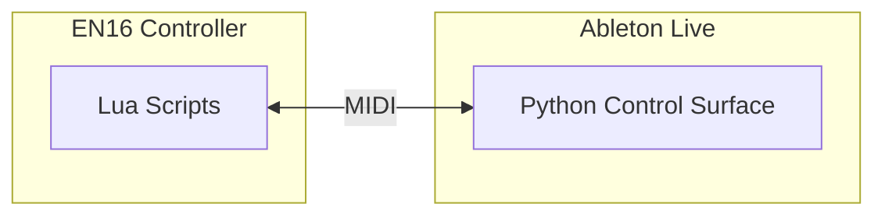

# Intech EN16 Ableton Control Surface


A custom Ableton Live control surface for the [Intech Grid EN16](https://intech.studio/shop/en16) controller.

## How It Works

This integration has two parts that communicate via MIDI:



| Component | Location | Purpose |
|-----------|----------|---------|
| **Control Surface** | `control_surface/Grid.py` | Python script running in Ableton that maps MIDI to tracks, devices, and clips |
| **EN16 Configuration** | `configs/EN16-Control.lua` | Lua scripts running on the EN16 that handle encoders, buttons, and LED feedback |

Both sides must agree on the MIDI layout (which CC/Note numbers mean what). See [Control Surface Architecture](docs/control-surface.md) for details.

## Features

| Control | Function |
|---------|----------|
| Buttons 1-8 | Select track (long press to arm) |
| Buttons 9-12 | Select Return track A-D |
| Buttons 13-16 | Launch/stop clips 1-4 on selected track |
| Encoders 1-8 | Device parameters |
| Encoders 9-12 | (available for custom mapping) |
| Encoder 13 | Send level to Return C |
| Encoder 14 | Send level to Return B |
| Encoder 15 | Send level to Return A |
| Encoder 16 | Volume (selected track) |

## Installation

### 1. Control Surface (Ableton)

1. Copy this folder to Ableton's Remote Scripts:

   ```text
   ~/Music/Ableton/User Library/Remote Scripts/Intech
   ```

2. In Ableton Live, go to **Preferences → Link, Tempo & MIDI**

3. Set Control Surface to **Intech**, Input/Output to your EN16 MIDI ports

4. Restart Ableton Live

### 2. EN16 Configuration

Upload the Lua configuration to your EN16 using Grid Editor or the CLI tool:

```bash
cd grid-cli && npm install
npx tsx grid-cli.ts upload ../configs/EN16-Control.json
```

See [EN16 Configuration Guide](docs/en16-config.md) for details on the Lua scripts.

## Documentation

- [Control Surface Architecture](docs/control-surface.md) - How the Ableton integration works
- [EN16 Configuration Guide](docs/en16-config.md) - Element scripts and MIDI routing
- [Lua Config Authoring Guide](docs/lua-config-guide.md) - Write configs in Lua
- [Grid CLI Tool](grid-cli/README.md) - Upload/download configurations
- [Grid Lua API](docs/grid-lua.md) - Full API reference
- [Grid Firmware Internals](docs/grid-firmware.md) - Device runtime details

## Project Structure

```text
Intech/
├── __init__.py              # Entry point
├── control_surface/
│   └── Grid.py              # Control surface implementation
├── configs/
│   ├── EN16-Control.json    # Grid config (JSON)
│   └── EN16-Control.lua     # Grid config (Lua)
├── grid-cli/                # CLI tool for config upload/download
├── docs/                    # Documentation
└── __ext__/                 # Git submodules (reference scripts)
```

## Development

### Prerequisites

- Ableton Live 11+
- Python 3.x (bundled with Live)

### Script Reloading

Add to `Options.txt` (requires Ableton Beta):

```text
-_ToolsMenuRemoteScripts
```

Location: `~/Library/Preferences/Ableton/Live x.x.x/Options.txt` (macOS) or `%APPDATA%\Ableton\Live x.x.x\Preferences\Options.txt` (Windows)

After editing Python files, clear cache and reload:

```bash
rm -rf __pycache__
```

Then toggle Control Surface in Preferences or use Tools → Reload MIDI Remote Scripts.

### Logs

```bash
tail -f ~/Library/Preferences/Ableton/Live\ */Log.txt | grep -i intech
```

### References

- [AbletonLive12_MIDIRemoteScripts](https://github.com/gluon/AbletonLive12_MIDIRemoteScripts) - Decompiled scripts
- [ableton-control-surface-toolkit](https://github.com/oslo1989/ableton-control-surface-toolkit) - Live object documentation

## Known Issues

**Initial sync delay**: On startup, Ableton sends parameter values before EN16's MIDI callback is ready. A one-shot timer fires after 1 second to request a refresh.

## License

MIT
