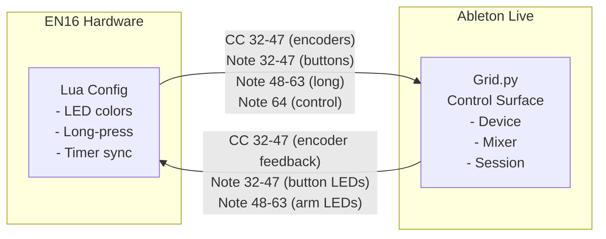

# Ableton Live Control Surface Architecture

Reference documentation for the MIDI Remote Scripts framework in Ableton Live 12.

## Overview

Control surfaces are Python scripts that enable hardware MIDI controllers to interact with Ableton Live. The framework provides a composable, event-driven architecture with hierarchical components, ownership-based resource management, and declarative control mapping.

**Reference:** `__ext__/AbletonLive12_MIDIRemoteScripts/_Framework/`

## Core Classes

### ControlSurface

Entry point for all control surface implementations. Manages the entire control surface lifecycle.

```python
class MyController(ControlSurface):
    def __init__(self, c_instance):
        super().__init__(c_instance)
        with self.component_guard():
            self._setup_controls()
            self._setup_components()

    def disconnect(self):
        # Cleanup resources
        super().disconnect()
```

**Key responsibilities:**
- Component registration and lifecycle management
- MIDI message routing via `receive_midi(midi_bytes)`
- Control element registry (`self.controls`)
- MIDI map rebuilding with `request_rebuild_midi_map()`
- Task scheduling for timed operations
- Global publishing via `publish_control_surface()`

**Reference:** `_Framework/ControlSurface.py`

### ControlSurfaceComponent

Base class for all components (mixer, session, transport, etc.).

```python
class MyComponent(ControlSurfaceComponent):
    def set_button(self, button):
        # Connect control element
        self._button = button

    def update(self):
        # Called when state changes
        super().update()
```

**Key features:**
- Enable/disable state with `is_enabled()`
- Layer assignment via `set_layer()`
- Event callbacks: `on_track_list_changed()`, `on_selected_track_changed()`
- Task group for timed operations

**Reference:** `_Framework/ControlSurfaceComponent.py`

### CompoundComponent

Extends `ControlSurfaceComponent` to manage sub-components hierarchically.

```python
class MyCompound(CompoundComponent):
    def __init__(self, *args, **kwargs):
        super().__init__(*args, **kwargs)
        self._child = self.register_component(ChildComponent())
```

**Reference:** `_Framework/CompoundComponent.py`

## Control Elements

### InputControlElement

Base class for MIDI input elements.

**MIDI Types:**
| Type | Value | Description |
|------|-------|-------------|
| `MIDI_NOTE_TYPE` | 0 | Note on/off |
| `MIDI_CC_TYPE` | 1 | Control Change |
| `MIDI_PB_TYPE` | 2 | Pitch Bend |
| `MIDI_SYSEX_TYPE` | 3 | System Exclusive |

**Key methods:**
- `receive_value(value)` - Called when MIDI received
- `add_value_listener(callback)` - Register handlers
- `connect_to(parameter)` - Direct parameter mapping
- `release_parameter()` - Disconnect from parameter

**Reference:** `_Framework/InputControlElement.py`

### ButtonElement

For momentary and toggle buttons.

```python
button = ButtonElement(
    is_momentary=True,
    msg_type=MIDI_CC_TYPE,
    channel=0,
    identifier=64
)
```

**States:**
- `ON_VALUE = ButtonValue(127)`
- `OFF_VALUE = ButtonValue(0)`

**Methods:**
- `is_pressed()` - Current button state
- `turn_on()` / `turn_off()` - LED control
- `set_light(value)` - Set LED color

**Reference:** `_Framework/ButtonElement.py`

### EncoderElement

For rotary encoders and continuous controllers.

```python
encoder = EncoderElement(
    msg_type=MIDI_CC_TYPE,
    channel=0,
    identifier=16,
    map_mode=Live.MidiMap.MapMode.relative_smooth_two_compliment
)
```

**Map Modes:**
| Mode | Description |
|------|-------------|
| `absolute` | Direct 0-127 mapping |
| `absolute_14_bit` | 14-bit precision |
| `relative_smooth_two_compliment` | Relative with smoothing |
| `relative_smooth_signed_bit` | Alternative relative |
| `relative_smooth_binary_offset` | Binary offset |

**Reference:** `_Framework/EncoderElement.py`

### SliderElement

Specialization of `EncoderElement` using `absolute` map mode. For faders and linear controls.

**Reference:** `_Framework/SliderElement.py`

## Layer System

Declarative control-to-component mapping.

```python
from _Framework.Layer import Layer

layer = Layer(
    play_button=play_button,
    volume_slider=volume_slider,
    stop_button=stop_button
)

component.set_layer(layer)
```

**How it works:**
1. Layer looks for `set_<control_name>()` method on component
2. Falls back to `<control_name>` attribute's `set_control_element()`
3. Raises `UnhandledControlError` if no handler found

**Combining layers:**
```python
combined = layer1 + layer2  # CompoundLayer with priority
```

**Reference:** `_Framework/Layer.py`

## Resource System

Ownership-based exclusive access to controls.

### ExclusiveResource

Only one client can own at a time.

```python
resource.grab(client)  # Request ownership
resource.release(client)  # Release ownership
resource.get_owner()  # Get current owner
```

### StackingResource

Multiple clients with priority-based access. Higher priority clients take control.

**Reference:** `_Framework/Resource.py`

## Event System

### Subject Slots

Automatically generates listener methods for Live object properties.

```python
from _Framework.SubjectSlot import subject_slot

class MyComponent(ControlSurfaceComponent):
    @subject_slot('value')
    def _on_value_changed(self, value):
        pass
```

Generated methods:
- `add_<event>_listener(callback)`
- `remove_<event>_listener(callback)`
- `notify_<event>(*args)`
- `<event>_has_listener(callback)`

**Reference:** `_Framework/SubjectSlot.py`

### Signal

Custom event system for loose coupling.

```python
from _Framework.Signal import Signal

my_signal = Signal()
my_signal.connect(handler)
my_signal()  # Fire signal
my_signal.disconnect(handler)
```

**Reference:** `_Framework/Signal.py`

## Built-in Components

### MixerComponent

Track mixing controls with banking.

```python
mixer = MixerComponent(
    num_tracks=8,
    num_returns=4,
    is_enabled=True
)
mixer.set_track_offset(0)
```

**Sub-components:**
- `_channel_strips[]` - Per-track controls
- `_return_strips[]` - Return track controls
- `_master_strip` - Master channel

**Reference:** `_Framework/MixerComponent.py`

### ChannelStripComponent

Single track controls.

**Element assignments:**
- Volume, pan, send controls
- Mute, solo, arm buttons
- Select button
- Crossfader toggle

**Reference:** `_Framework/ChannelStripComponent.py`

### SessionComponent

Clip matrix control (session view).

```python
session = SessionComponent(
    num_tracks=8,
    num_scenes=5,
    is_enabled=True
)
session.set_offsets(track_offset=0, scene_offset=0)
```

**Features:**
- Grid of `SceneComponent` x `ClipSlotComponent`
- Horizontal/vertical banking
- Clip launch and stop controls
- Scene launch buttons

**Reference:** `_Framework/SessionComponent.py`

### TransportComponent

Playback controls.

```python
transport = TransportComponent()
transport.set_play_button(play_button)
transport.set_stop_button(stop_button)
transport.set_record_button(record_button)
```

**Controls:**
- Play, stop, record
- Loop, punch in/out
- Overdub, session record
- Metronome, tap tempo
- Tempo control (60-200 BPM)

**Reference:** `_Framework/TransportComponent.py`

### DeviceComponent

Selected device parameter control.

```python
device = DeviceComponent()
device.set_parameter_controls(encoder_matrix)
device.set_bank_buttons(bank_up, bank_down)
device.set_on_off_button(on_off_button)
```

**Features:**
- Device bank switching
- Parameter bank management
- Lock/unlock functionality

**Reference:** `_Framework/DeviceComponent.py`

### ModesComponent

Mode switching for multi-function controls.

```python
from _Framework.ModesComponent import ModesComponent, LayerMode

modes = ModesComponent()
modes.add_mode('session', LayerMode(session, session_layer))
modes.add_mode('mixer', LayerMode(mixer, mixer_layer))
modes.selected_mode = 'session'
```

**Mode types:**
- `Mode` - Basic with `enter_mode()` / `leave_mode()`
- `ComponentMode` - Wraps component enable/disable
- `LayerMode` - Component + Layer combination
- `CompoundMode` - Multiple modes as tuple

**Reference:** `_Framework/ModesComponent.py`

## Dependency Injection

Lightweight DI for component wiring.

```python
from _Framework.Dependency import depends, inject

@depends(song=None, show_message=None)
def my_function(song=None, show_message=None):
    song()  # Access Live song
    show_message('Hello')  # Show status bar message

# Register providers
inject(
    song=lambda: self.song(),
    show_message=const(self.show_message)
).everywhere()
```

**Reference:** `_Framework/Dependency.py`

## Lifecycle

### Initialization

```python
def create_instance(c_instance):
    return MyController(c_instance)

def get_capabilities():
    return {
        CONTROLLER_ID_KEY: controller_id(
            vendor_id=0x1234,
            product_ids=[0x5678]
        ),
        PORTS_KEY: [
            inport(props=[NOTES_CC, SCRIPT, REMOTE]),
            outport(props=[SCRIPT, REMOTE])
        ]
    }
```

### Component Guard

Batch control updates during initialization:

```python
with self.component_guard():
    # All component setup here
    # Updates are deferred until exit
    pass
```

### Disconnect

```python
def disconnect(self):
    # Components disconnect recursively
    # Event listeners are cleaned up
    # Resources are released
    super().disconnect()
```

## Task System

Timed operations and scheduling.

```python
self._tasks.add(Task.run(self._delayed_action))
self._tasks.add(Task.sequence(
    Task.delay(1),  # Wait 1 tick
    Task.run(self._action)
))
```

**Task types:**
- `Task.run(func)` - Execute function
- `Task.delay(ticks)` - Wait ticks
- `Task.sequence(*tasks)` - Run sequentially

**Reference:** `_Framework/Task.py`

## Example: Minimal Control Surface

```python
from _Framework.ControlSurface import ControlSurface
from _Framework.TransportComponent import TransportComponent
from _Framework.ButtonElement import ButtonElement
from _Framework.InputControlElement import MIDI_CC_TYPE

class MinimalController(ControlSurface):
    def __init__(self, c_instance):
        super().__init__(c_instance)
        with self.component_guard():
            self._setup()

    def _setup(self):
        # Create transport component
        transport = TransportComponent()

        # Create play button (CC 64 on channel 1)
        play_button = ButtonElement(
            is_momentary=True,
            msg_type=MIDI_CC_TYPE,
            channel=0,
            identifier=64
        )

        # Connect button to transport
        transport.set_play_button(play_button)

def create_instance(c_instance):
    return MinimalController(c_instance)
```

## Intech EN16 Integration

This project implements a control surface for the Intech Grid EN16 controller. The integration requires two parts working together:

### Architecture Overview



### Shared MIDI Layout

Both sides must agree on the MIDI message mapping:

| Control | MIDI Type | Channel | Identifiers | Direction |
|---------|-----------|---------|-------------|-----------|
| Encoders | CC | 0 | 32-47 | Bidirectional |
| Buttons | Note | 0 | 32-47 | EN16 → Ableton |
| Long Buttons | Note | 0 | 48-63 | EN16 → Ableton |
| Control Button | Note | 0 | 64 | EN16 → Ableton |
| Button LEDs | Note | 0 | 32-47 | Ableton → EN16 |
| Arm LEDs | Note | 0 | 48-63 | Ableton → EN16 |

### EN16 Side (Lua)

The EN16 runs Lua scripts that handle hardware-specific behavior:

**Responsibilities:**
- Send encoder values as CC messages
- Detect button presses and long-presses
- Receive MIDI feedback to update LED states
- Periodic sync via timer (Note 64)

**Key Lua callbacks:**
```lua
-- Receive MIDI feedback from Ableton
function self.midirx_cb(self, event, header)
    local cmd, el, val = event[2], event[3] - 32, event[4]
    if cmd == MIDI_CC then
        element[el]:encoder_value(val)  -- Update encoder ring
    elseif cmd == MIDI_NOTE then
        element[el]:led_value(1, val == 127 and 100 or 0)  -- Update LED
    end
end

-- Long-press detection on button release
if self:button_state() == 0 then
    if self:button_elapsed_time() > 1000 then
        note = note + 16  -- Use long-press note range
    end
end
```

**Reference:** [EN16 Configuration](en16-config.md)

### Ableton Side (Python)

The Python control surface (`control_surface/Grid.py`) handles Ableton integration:

**Responsibilities:**
- Create control elements matching EN16 MIDI layout
- Connect controls to Ableton components
- Send feedback to update EN16 LEDs/encoders
- Handle track/device selection changes

**Control element setup:**
```python
# Must match EN16 Lua configuration
CHANNEL = 0
ENCODER_CC_START = 32      # CC 32-47
BUTTON_NOTE_START = 32     # Note 32-47
LONG_BUTTON_NOTE_START = 48  # Note 48-63
CONTROL_BUTTON_NOTE = 64   # Note 64

# Create elements
self._encoders = [make_encoder(cc, "Encoder_%d" % i)
                  for i, cc in enumerate(range(32, 48))]
self._buttons = [make_button(note, "Button_%d" % i)
                 for i, note in enumerate(range(32, 48))]
```

**Component wiring:**
```python
# Device control (encoders 0-7)
device = DeviceComponent()
device.set_parameter_controls(tuple(self._encoders[0:8]))

# Mixer (buttons 0-7 for track select, long buttons for arm)
mixer = MixerComponent(num_tracks=8, num_returns=4)
for i in range(8):
    strip = mixer.channel_strip(i)
    strip.set_select_button(self._buttons[i])
    strip.set_arm_button(self._long_buttons[i])

# Session (buttons 12-15 for clip launch)
session = SessionComponent(num_tracks=1, num_scenes=4)
session.set_clip_launch_buttons(clip_matrix)
```

**Reference:** `control_surface/Grid.py`

### Startup Synchronization

There's a race condition at startup: Ableton sends parameter values before the EN16's `midirx_cb` callback is installed. To work around this, the EN16 global setup starts a one-shot timer that fires after 1 second:

```lua
-- In global setup
timer_start(self, 1000)  -- Fire once after 1 second
```

```
EN16 Timer (once) → Note 64 ON → Grid._on_control() → self.update()
```

This triggers Ableton to resend all parameter values after the EN16 is ready to receive them.

### Adding New Features

To add a new control:

1. **EN16 Lua:** Add handler in element script
   ```lua
   -- Button event: send note
   midi_send(CH, MIDI_NOTE, 70, self:button_value())
   ```

2. **Python:** Create matching control element
   ```python
   new_button = ButtonElement(True, MIDI_NOTE_TYPE, 0, 70)
   ```

3. **Python:** Connect to component
   ```python
   transport.set_play_button(new_button)
   ```

4. **EN16 Lua:** Handle feedback in `midirx_cb`
   ```lua
   if el == 70 then
       element[idx]:led_value(1, val == 127 and 100 or 0)
   end
   ```

## Reference Implementations

- **APC40** - Comprehensive example with session, mixer, device, transport
- **APC64** - Modern implementation with OLED displays
- **Push2** - Advanced implementation with custom graphics
- **Launchpad** - Grid-based session control

All located in `__ext__/AbletonLive12_MIDIRemoteScripts/`

## Key Files Reference

| File | Description |
|------|-------------|
| `_Framework/ControlSurface.py` | Main entry point (32KB) |
| `_Framework/ControlSurfaceComponent.py` | Component base class |
| `_Framework/InputControlElement.py` | MIDI input base (17KB) |
| `_Framework/ButtonElement.py` | Button controls |
| `_Framework/EncoderElement.py` | Encoder controls |
| `_Framework/MixerComponent.py` | Track mixer (14KB) |
| `_Framework/SessionComponent.py` | Clip grid (26KB) |
| `_Framework/TransportComponent.py` | Transport controls |
| `_Framework/DeviceComponent.py` | Device parameters (19KB) |
| `_Framework/Layer.py` | Declarative mapping |
| `_Framework/ModesComponent.py` | Mode switching (28KB) |
| `_Framework/Resource.py` | Ownership system |
| `_Framework/SubjectSlot.py` | Event system |

### Project Files

| File | Description |
|------|-------------|
| `__init__.py` | Entry point, exports `create_instance()` |
| `control_surface/Grid.py` | EN16 control surface implementation |
| `configs/EN16-Control.lua` | EN16 Lua configuration (human-readable) |
| `configs/EN16-Control.json` | EN16 JSON configuration (Grid Editor) |
