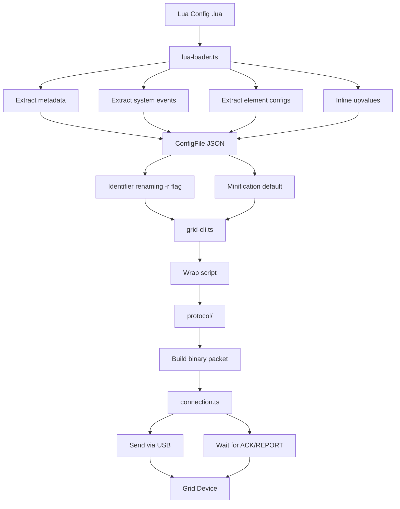

# Grid CLI Architecture

A TypeScript CLI tool for uploading and downloading Grid controller configurations via USB serial communication.

## Overview

Grid CLI manages configurations for Intech Grid controllers (EN16, PO16, BU16, EF44, PBF4, TEK2, PB44). It supports two configuration formats:

- **JSON** - Binary Grid Editor format
- **Lua** - Human-readable format with Grid library

## File Structure

```
grid-cli/
├── grid-cli.ts        # CLI entry point, commands
├── connection.ts      # Serial communication abstraction
├── lib.ts             # Shared utilities, types, constants
├── lua-loader.ts      # Lua parsing and JSON conversion
├── protocol/          # Grid protocol layer
│   ├── index.ts       # Module exports
│   ├── packet.ts      # Packet building and parsing
│   └── types.ts       # Protocol type definitions
├── lib.test.ts        # Unit tests for lib.ts
├── lua-loader.test.ts # Unit tests for lua-loader.ts
├── CLAUDE.md          # Claude Code instructions
└── docs/
    ├── architecture.md
    └── coding-style.md
```

## Core Modules

### grid-cli.ts

Main CLI entry point using the `commander` library.

**Commands:**

- `upload <config>` - Upload JSON/Lua config to device
- `download <output>` - Download current config as JSON
- `convert <input>` - Convert Lua to JSON format

**Key Functions:**

- `uploadConfig()` - Uploads scripts with progress tracking
- `downloadConfig()` - Fetches configuration from device
- `loadConfig()` - Loads JSON or Lua config files
- `validateConfig()` - Validates scripts before upload

**Dependencies:**

- `commander` - CLI argument parsing
- `./connection` - Serial communication
- `./protocol` - Packet building/parsing

### connection.ts

Serial communication abstraction for Grid devices.

**Class: `GridConnection`**

- `static connect(port?)` - Find and connect to Grid device
- `close()` - Close the connection
- `sendAndWait<T>()` - Generic async communication with timeout/retry
- `sendAndWaitAck()` - Wait for ACKNOWLEDGE response
- `sendAndWaitReport()` - Wait for CONFIG REPORT response
- `uploadScript()` - Upload script to element/event
- `fetchScript()` - Fetch script from element/event

**Dependencies:**

- `serialport` - USB serial communication

### protocol/

Grid binary protocol layer.

**Files:**

- `types.ts` - Type definitions (DecodedFrame, Packet, SendOptions, ConfigParams)
- `packet.ts` - Packet building and parsing functions
- `index.ts` - Module exports

**Key Functions:**

- `buildConfigPacket()` - Creates binary packets for CONFIG commands
- `parsePacket()` - Decodes binary frames from device responses
- `parseConfigReport()` - Extracts actionString from REPORT
- `hasAcknowledge()` - Checks for ACK in response

**Dependencies:**

- `@intechstudio/grid-protocol` - Binary protocol encoding/decoding

### lib.ts

Shared utilities and type definitions.

**Constants:**

- `MAX_ACTION_LENGTH = 909` - Max script size per element/event
- `SYSTEM_ELEMENT = 255` - Reserved element for system-level events
- `EVENT_NAMES` - Maps event IDs (0-8) to names
- `DEVICE_CONFIG` - Hardware configs for 7 device types
- `USB_FILTERS` - USB VID/PID filters for device detection
- `PROGRESS_BAR_WIDTH = 20` - Progress bar rendering width

**Types:**

- `ConfigFile` - Main config structure
- `ElementConfig` - Element-level configuration
- `EventConfig` - Individual event handler

**Functions:**

- `wrapScript()` / `unwrapScript()` - Protocol wrapper handling
- `validateActionLength()` - Enforces 909 char limit
- `countEvents()` - Counts non-empty events
- `parseEventType()` - Validates event type
- `sortElements()` - Sorts with system element last
- `renderProgress()` - ASCII progress bar
- `forEachEvent()` / `mapEvents()` - Config iteration helpers

### lua-loader.ts

Lua script parsing and conversion to JSON format.

**Lua VM:**

- Uses Fengari (Lua in JavaScript) with Grid API stubs
- Executes Lua configs in sandboxed environment
- Extracts function bodies via AST parsing (luaparse)

**Key Components:**

1. **Lua Stack Helpers**
   - `toAbsoluteIndex()` - Normalizes negative stack indices
   - `LuaState` type alias for Fengari state

2. **AST-Based Extraction**
   - `parseFunctions()` - Parses Lua and extracts function locations
   - `extractFunctionBody()` - Gets function body using AST ranges
   - `collectFunctions()` - Recursively collects function nodes

3. **Value Serialization**
   - `serializeLuaValue()` - Converts Lua values to literal strings
   - `MAX_SERIALIZABLE_ARRAY_LENGTH = 20` - Limit for table serialization

4. **Upvalue Inlining**
   - `getUpvalues()` - Uses Lua debug API to extract closure variables
   - `inlineUpvalues()` - Replaces upvalue references with values

5. **Identifier Renaming** (`-r` flag)
   - `NameGenerator` - Generates short names (a, b, ..., z, aa, ab, ...)
   - `collectIdentifiers()` - Extracts identifiers with scope info
   - `renameIdentifiers()` - Multi-script renaming with consistent globals
   - `shouldRename()` / `needsRenaming()` - Filtering predicates
   - `UPPERCASE_CONST_PATTERN` - Regex for user constants

6. **Config Extraction**
   - `extractMetadata()` - Parses name, type, version
   - `extractSystemEvents()` - Gets system element events
   - `extractElementConfigs()` - Gets element-specific events
   - `isUserGlobal()` - Identifies user-defined globals

**Main Exports:**

- `loadLuaConfig(filePath)` - Converts Lua file to ConfigFile object
- `renameIdentifiers(scripts)` - Renames identifiers across scripts

## Data Flow



## Key Abstractions

| Abstraction      | Purpose                          | Location          |
| ---------------- | -------------------------------- | ----------------- |
| `ConfigFile`     | Unified format for JSON/Lua      | lib.ts            |
| `EventConfig`    | Normalized event representation  | lib.ts            |
| `GridConnection` | Serial communication wrapper     | connection.ts     |
| `Packet`         | Binary protocol wrapper          | protocol/types.ts |
| `DecodedFrame`   | Parsed protocol response         | protocol/types.ts |
| `FunctionNode`   | AST function location info       | lua-loader.ts     |
| `IdentifierInfo` | Scope-aware identifier tracking  | lua-loader.ts     |
| `NameGenerator`  | Sequential short name allocation | lua-loader.ts     |
| `LuaState`       | Fengari VM state handle          | lua-loader.ts     |

## Supported Devices

| Device | Elements    | Events                                |
| ------ | ----------- | ------------------------------------- |
| EN16   | 16 + system | init, encoder, button, timer          |
| PO16   | 16 + system | init, potmeter, button, timer         |
| BU16   | 16 + system | init, button, timer                   |
| EF44   | 16 + system | init, encoder, button, endless, timer |
| PBF4   | 8 + system  | init, potmeter, button, timer         |
| TEK2   | 8 + system  | init, encoder, button, timer          |
| PB44   | 8 + system  | init, potmeter, button, timer         |

## Event Types

| ID  | Name     | Description            |
| --- | -------- | ---------------------- |
| 0   | init     | Element initialization |
| 1   | potmeter | Potentiometer movement |
| 2   | encoder  | Rotary encoder turn    |
| 3   | button   | Button press/release   |
| 4   | utility  | System utility event   |
| 5   | midirx   | MIDI receive callback  |
| 6   | timer    | Periodic timer event   |
| 7   | endless  | Infinite rotary (EF44) |
| 8   | draw     | Display draw event     |

## Protocol

Communication uses the `@intechstudio/grid-protocol` library for binary packet encoding/decoding. Packets are wrapped with SOH/EOT markers and include checksums.

**Constants:**

- `SERIAL_BAUD_RATE = 2000000`
- `FRAME_TERMINATOR_SIZE = 3` (EOT + 2 checksum bytes)
- `DEFAULT_TIMEOUT_MS = 500`
- `DEFAULT_RETRIES = 2`

**USB Device Filters:**

- VID/PID: 03eb:ecac (D51), 03eb:ecad (D51 alt), 303a:8123 (ESP32)

## Testing

Tests use Vitest:

- `lib.test.ts` - Unit tests for utilities
- `lua-loader.test.ts` - Unit tests for Lua parsing

Run with: `npm test`
